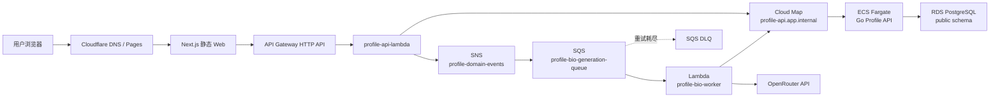
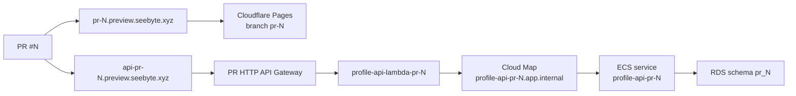

# Full Stack Learning

一个以 AWS 服务端架构为主线的 Go 云原生学习项目。项目从本地 Go、PostgreSQL 和 Next.js 开始，逐步搭建到生产可用的容器、Serverless、异步消息、可观测性和 PR 独立预览环境。

生产站点：

- Web：<https://full-stack.seebyte.xyz>
- API：<https://f7a52mymmg.execute-api.ap-northeast-1.amazonaws.com>
- AWS Region：`ap-northeast-1`（东京）

## 项目目标

- 用 Go 实现 Profile API，并运行在 ECS Fargate。
- 使用 RDS PostgreSQL 持久化 Profile 和 Bio 生成任务。
- 使用 API Gateway、Lambda 和 Cloud Map 组成私有服务入口。
- 使用 SNS、SQS、Worker Lambda 和 DLQ 实现异步 Bio 生成。
- 使用 CloudWatch Synthetics、Alarm 和 SNS Email 做生产巡检与通知。
- 为每个 PR 创建互相隔离的 Web、Lambda、ECS、API Gateway 和数据库 Schema Preview。
- 优先学习 AWS Console 手动配置，再使用 CLI 做应用发布和验证，最后再考虑 IaC。

## 生产架构

正式入口不是 ALB。ALB 仅保留为调试或历史预览用途。



### 普通 API 请求

```text
Cloudflare → API Gateway → API Lambda → Cloud Map → Go/ECS → PostgreSQL
```

API Lambda 不保存数据库凭据，也不直接连接 RDS。它通过 VPC 内的 Cloud Map DNS 调用 Go 服务。

### 异步生成 Bio

```text
Web
  → API Gateway
  → API Lambda
  → Go 创建数据库任务
  → SNS
  → SQS
  → Worker Lambda
  → OpenRouter
  → Go 写入 Profile 并完成任务
  → PostgreSQL
```

Web 收到 `202 + jobId` 后轮询任务状态。任务会经历 `pending`、`running`、`completed` 或 `failed`。Worker 使用 SQS partial batch response，让失败消息重试；超过接收次数后进入 DLQ。

`OPENROUTER_API_KEY` 只应存在于 Worker Lambda 的运行环境中，禁止写入 Web、Git 仓库、日志或请求正文。

## CloudWatch Synthetics 巡检

生产 Canary 使用 Synthetics 内置 Schedule，不依赖 EventBridge：

```text
Synthetics Schedule
  → Canary 执行三个只读 HTTPS 检查
  → CloudWatch Metrics / Logs / Alarm
  → SNS Topic
  → Email
```

当前检查：

1. `GET https://full-stack.seebyte.xyz`
2. `GET /health`
3. `GET /ready`

仓库中的 [`apps/canary`](apps/canary/README.md) 保存 Multi-checks 配置副本和离线校验器。它不会自动更新 AWS 中的 Canary；当前仍由 Console 手动维护。

## PR 独立 Preview

Preview 不绑定某一个固定 Git 分支。任意同仓库的开放 PR，只要改动命中 Preview workflow 的 paths，就会在 `opened`、`reopened` 或 `synchronize` 时触发。



每个 PR 使用独立域名、API、Lambda、Cloud Map service、ECS service 和 PostgreSQL Schema，避免影响生产及其他 PR。PR 关闭时 cleanup workflow 删除对应 Preview 资源和精确 DNS 记录。

Preview 会产生额外 AWS 和 Cloudflare 资源成本。创建 PR 前应确认确实需要完整环境，并在 PR 关闭后检查清理结果。

## 核心 AWS 资源

| 类型 | 资源 |
| --- | --- |
| API Gateway | `f7a52mymmg` |
| API Lambda | `profile-api-lambda` |
| Worker Lambda | `profile-bio-worker` |
| ECS Cluster | `profile-learning-cluster` |
| ECS Service | `profile-api-service` |
| ECR | `017719539487.dkr.ecr.ap-northeast-1.amazonaws.com/profile-api` |
| VPC | `vpc-0a5fde16ffff0d9e5` |
| Cloud Map Namespace | `app.internal` |
| Cloud Map Service | `profile-api` |
| SNS 业务 Topic | `profile-domain-events` |
| SQS 主队列 | `profile-bio-generation-queue` |
| SQS DLQ | `profile-bio-generation-dlq` |
| SNS 告警 Topic | `profile-ops-alerts` |

## 功能范围

Go API 当前包含：

- `GET /health`
- `GET /ready`
- `POST /api/profiles`
- `GET /api/profiles/{username}`
- `PATCH /api/profiles/{username}`
- `GET /api/bio-jobs/{jobId}`
- Bio Job 内部创建、领取、完成和失败接口
- PostgreSQL 持久化
- bcrypt 密码哈希和 HTTP Basic Authentication
- `bio` 最多 500 个 Unicode 字符
- 生产域名和 `pr-N.preview.seebyte.xyz` CORS 限制

API Lambda 提供 `POST /api/profiles/generate-bio`。Web 只展示名字输入、生成状态和最终 Bio，不暴露内部 username、随机密码或模型推理细节。

## 目录结构

```text
full-stack-learning/
├── apps/
│   ├── api/            # Go HTTP API、Profile 与 Bio Job 领域逻辑
│   ├── bio-worker/     # SQS Worker Lambda，调用 OpenRouter
│   ├── canary/         # Synthetics Multi-checks 配置与离线校验
│   ├── db-bootstrap/   # 一次性数据库初始化 Fargate Task
│   ├── lambda/         # API Gateway 后的 API Lambda
│   └── web/            # Next.js 静态导出 Web
├── infra/iam/          # 异步链路最小 IAM 策略模板
├── packages/           # TypeScript 共享配置、环境与 UI
├── scripts/preview/    # PR Preview 创建、验证和销毁脚本
├── .github/workflows/  # 生产部署与 PR Preview workflows
├── buildspec.yml       # Go 生产构建与 ECS 发布
└── buildspec.preview*.yml
```

## 本地开发

### 前置工具

- Node.js 22
- pnpm 11.9.0
- Go 1.26
- Docker / Docker Compose

### 安装依赖

```bash
pnpm install --frozen-lockfile
```

### 启动 PostgreSQL

```bash
docker compose up -d postgres
docker compose ps
```

本地 PostgreSQL 使用宿主机端口 `5433`。首次建表和 Go API 分步教程见 [`apps/api/README.md`](apps/api/README.md)。

### 启动 Go API

在 `apps/api` 中准备以下环境变量：

```text
APP_ENV=development
HTTP_PORT=8080
DATABASE_HOST=localhost
DATABASE_PORT=5433
DATABASE_USER=profile_user
DATABASE_PASSWORD=<local-password>
DATABASE_NAME=profile_db
DATABASE_SSL_MODE=disable
DATABASE_SCHEMA=public
BIO_JOB_INTERNAL_KEY=<local-shared-key>   # 启用 Bio Job 内部接口时需要
```

然后运行：

```bash
cd apps/api
go run ./cmd/server
```

### 启动 Web

```bash
NEXT_PUBLIC_PROFILE_API_URL=http://localhost:8080 pnpm --filter web dev
```

本地地址：<http://localhost:3001>。

Lambda 和 Worker 的完整异步链路依赖 SNS、SQS、VPC 和 Cloud Map，通常在 AWS 环境验证；单元测试和构建可以完全在本地完成。

## 环境变量边界

只列变量名，不在仓库保存真实值。

### Go / ECS

- `APP_ENV`
- `HTTP_PORT`
- `DATABASE_HOST`
- `DATABASE_PORT`
- `DATABASE_USER`
- `DATABASE_PASSWORD`
- `DATABASE_NAME`
- `DATABASE_SSL_MODE`
- `DATABASE_SSL_ROOT_CERT`
- `DATABASE_SCHEMA`：只允许 `public` 或 `pr_<正整数>`
- `CORS_ALLOWED_ORIGINS`
- `BIO_JOB_INTERNAL_KEY`

### API Lambda

- `PROFILE_API_BASE_URL`
- `BIO_JOB_TOPIC_ARN`
- `BIO_JOB_INTERNAL_KEY`

### Worker Lambda

- `PROFILE_API_BASE_URL`
- `BIO_JOB_INTERNAL_KEY`
- `OPENROUTER_API_KEY`

### Web

- `NEXT_PUBLIC_PROFILE_API_URL`

`BIO_JOB_INTERNAL_KEY` 必须在 API Lambda、Worker Lambda 和 Go ECS 中一致。数据库凭据只属于 Go/ECS 和数据库初始化任务；OpenRouter Key 只属于 Worker。

## 测试与构建

```bash
# Go
cd apps/api && go test ./...

# API Lambda
pnpm --filter lambda test
pnpm --filter lambda build

# Worker Lambda
pnpm --filter bio-worker test
pnpm --filter bio-worker build

# Web
pnpm --filter web build

# Synthetics 配置离线校验
node apps/canary/validate.mjs

# Monorepo TypeScript 类型检查
pnpm check-types
```

`pnpm check` 当前会执行 Biome 并自动写入格式化修复，运行前应先确认工作树范围。

## CI/CD

生产 workflows 仅监听 `main`，并通过 paths 区分部署范围：

| Workflow | 主要触发路径 | 部署目标 |
| --- | --- | --- |
| `Deploy Go API to ECS` | `apps/api/**`、`buildspec.yml` | CodeBuild → ECR → ECS |
| `Deploy Lambda` | `apps/lambda/**`、共享配置、lockfile | `profile-api-lambda` |
| `Deploy Bio Worker Lambda` | `apps/bio-worker/**`、共享配置、lockfile | `profile-bio-worker` |
| `Deploy Web to Cloudflare Pages` | `apps/web/**`、共享配置、lockfile | Cloudflare Pages |

推送普通功能分支不会触发生产部署。存在开放 PR 时，push 可能触发 `pull_request synchronize`，进而创建或更新完整 Preview。

### 重要部署边界

- `buildspec.yml` 负责 Go 测试、镜像构建、推送 ECR 和 ECS 滚动更新。
- Go 生产 workflow **不执行数据库迁移或 bootstrap**。
- 数据库结构变更必须先运行独立、可重复的 `db-bootstrap` Task，再部署依赖新结构的应用。
- Lambda 的代码更新不会自动创建环境变量、IAM、SNS、SQS 或事件源映射。
- SQS → Worker 事件源映射必须处于 `Enabled`，异步消息才会被消费。

## 安全原则

- 禁止提交 AWS 凭据、数据库密码、OpenRouter Key、Cloudflare Token 或内部共享 Key。
- Web 只能包含公开的 API URL，不得包含服务端 Secret。
- Basic Auth 只允许通过 HTTPS 使用。
- API Lambda 不读取数据库 Secret；Worker 不读取数据库 Secret。
- RDS 使用最小权限应用账号，生产连接使用 TLS 验证。
- ECS、Lambda、CodeBuild 和 GitHub OIDC Role 使用各自最小 IAM 权限。
- 日志不得记录密码、Authorization、API Key、完整请求正文或 Provider 错误正文。

## 成本与停用

主要持续成本来自 RDS、ECS Fargate、NAT/网络、ALB 遗留资源、Synthetics、CloudWatch Logs 和 PR Preview。

- 不使用 Preview 时及时关闭 PR，并确认 cleanup workflow 已成功。
- Canary 可临时 Stop；停止后仍需关注 S3 artifacts、Logs 和 Alarm 的保留成本。
- CloudWatch 仅保留必要的 ECS、Lambda 和 Canary 日志。
- SQS 主队列与 DLQ 通常成本很低，但必须监控积压和失败重试。
- 停止 ECS task 或 Lambda 不会自动停止 RDS、ALB、NAT、S3 和日志存储成本。

## 进一步阅读

- [`apps/api/README.md`](apps/api/README.md)：Go、PostgreSQL、Docker 与 ECR 学习步骤
- [`apps/lambda/README.md`](apps/lambda/README.md)：API Lambda 路由、异步切换与安全边界
- [`apps/bio-worker/README.md`](apps/bio-worker/README.md)：Worker、OpenRouter、重试与 DLQ
- [`apps/db-bootstrap/README.md`](apps/db-bootstrap/README.md)：数据库初始化 Task
- [`apps/canary/README.md`](apps/canary/README.md)：Synthetics Multi-checks 配置
